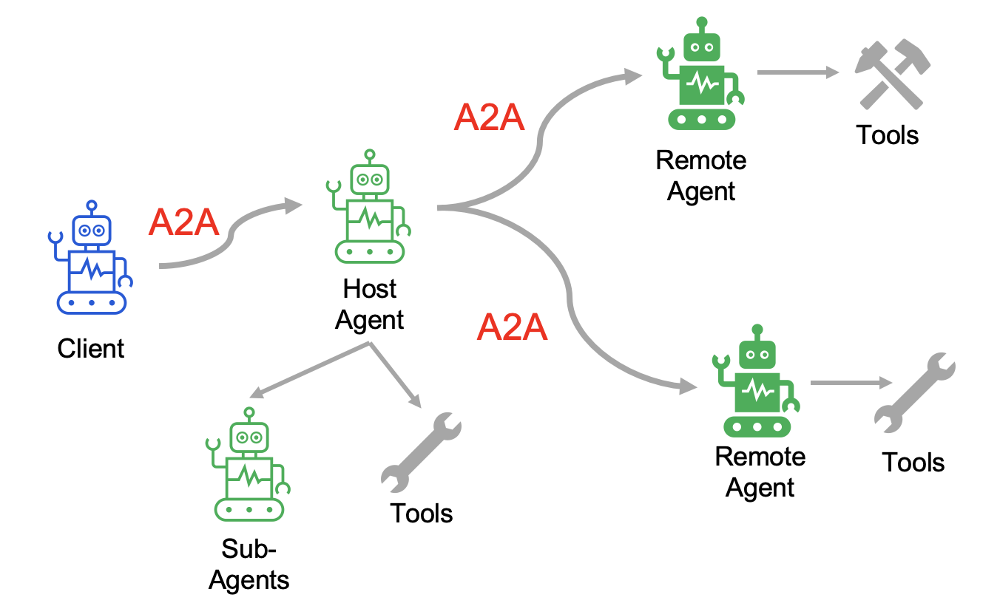
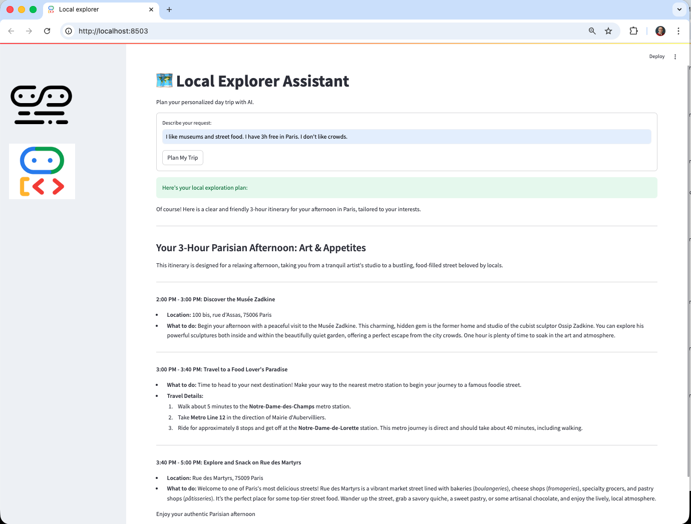

# Introduction


</img>

This project modifies a previous project: [Local Explorer Assistant](https://github.com/gabrielpreda/local-explorer-assistant) by the followings:
- Introduce A2A  (Agent to Agent protocol from Google);
- Separate Discovery and Routing Agents as separate services;
- Exposes Discovery and Routing Agents using A2A;
- Keep Composer Agent as SubAgent of the Root Agent, and modify this one to be as well exposed as A2AServer;
- Add a A2AClient component;
- Small facelift of the Streamlit UI.
- Add a logging integrator component, to be able to monitor in one place all the logs from the A2A Servers; this uses the functionality from the new module `logging_ring.py` and a custom Streamlit UI.


# Ho to run

The instructions are for running the project on local

## Configure your local environment

Start by editing the .env file. Copy your `.env.example` as `.env` and replace the placeholders with your actual values.

```bash
GOOGLE_GENAI_USE_VERTEXAI=true
GOOGLE_CLOUD_PROJECT=<YOUR_PROJECT_ID>
GOOGLE_CLOUD_LOCATION=<YOUR_REGION>
```

## Start the A2A servers

Start the Discovery Agent A2A Server (1st Remote Agent):
```bash
uvicorn discovery:application --host 0.0.0.0 --port 10020
```

Start the Routing Agent A2A Server (2nd Remote Agent):
```bash
uvicorn agent:application --host 0.0.0.0 --port 10022
```

Start the Root Agent A2A Server (Host Agent):
```bash
uvicorn agent:application --host 0.0.0.0 --port 10022
```

## Start the A2A Client

The A2A Client exposes a FastAPI service for the UI. It instantiate a A2A Client to connect to the host agent.

Start the A2A Client with the following command:
```bash
uvicorn main:app --host 0.0.0.0 --port 8000
```

## Start the UI (Streamlit)

Start the user interface:
```bash
streamlit run streamlit_ui.py --server.port 8501
```

Here is an image of the main client application user interface:

</img>


## Start the UI for monitoring logs

Start the user interface:
```bash
streamlit run streamlit__logs_ui.py --server.port 8502
```

Here is an image of the A2A Agents monitoring logs user interface:

</img>